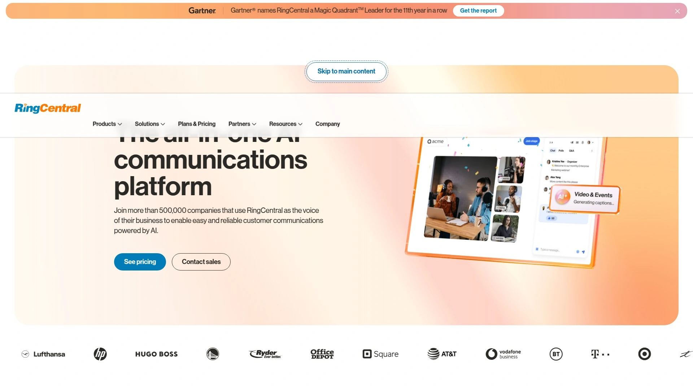
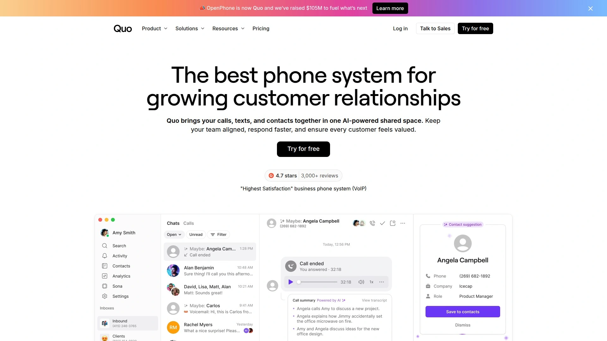

# 2025's Top 9 Best Business Phone Number Services

Every business reaches that moment when giving out your personal cell number to clients starts feeling like a mistake you can't undo. You're fielding customer calls during dinner, missing important leads because your phone was off, and there's zero separation between your work life and the rest of your existence. A dedicated business phone number solves this mess, but the old-school approach—signing contracts with telecom companies, installing hardware, paying setup fees—feels like overkill when you're running things from a laptop and a dream.

Modern virtual phone services changed everything by putting full business phone systems in your pocket. These platforms deliver toll-free numbers, vanity numbers that spell out your brand name, call forwarding that follows you anywhere, voicemail transcription, and analytics that show exactly when customers are trying to reach you. Whether you need a memorable 800 number for marketing campaigns or a local number that builds trust in your community, today's business phone systems make it stupid simple to look professional without the stupid-high costs or technical headaches traditional phone companies demand.

***

## **[800.com](https://800.com)**

Instant toll-free and vanity numbers with complete call management features.

Getting a business phone number through 800.com takes about five minutes from browsing to activation, with no installer visits or equipment purchases required. The platform specializes in toll-free numbers across all available prefixes—800, 888, 877, 866, 855, 844, and 833—giving businesses multiple options when searching for available vanity numbers. You can search for numbers that spell words related to your business or choose memorable digit patterns from their Vanity Number Marketplace, which houses hundreds of easy-to-remember options.

Every plan includes essential features like desktop and mobile apps, VoIP/WiFi calling, call forwarding (standard, sequential, and simultaneous), business greetings, extensions, fax numbers, call recording, business texting, call analytics, API access, voicemail boxes with transcription, and call screening. The call forwarding system routes calls to cell phones or business landlines automatically, meaning you never miss customer contact regardless of location. Plans start at $23 monthly for individuals and scale to $150 monthly for larger teams, with 15% savings available on annual billing.

Customer testimonials consistently highlight the platform's reliability, ease of setup, and AI-generated voicemail tools that create professional greetings from text input. The user dashboard provides straightforward number management, call routing configuration, and analytics access without requiring technical expertise. For businesses prioritizing quick deployment and memorable toll-free numbers, 800.com delivers immediately usable phone systems that enhance credibility while maintaining affordable monthly costs.

***

## **[RingCentral](https://www.ringcentral.com)**

Enterprise-grade unified communications with flexible toll-free number options.

RingCentral functions as a comprehensive unified communications platform powered by AI, extending beyond basic phone service into team collaboration and contact center solutions. When signing up for RingEX, users receive a virtual number free with their subscription and can select toll-free alternatives during setup. The platform offers all standard toll-free prefixes (800, 888, 877, 866, 855, 844) plus custom vanity number creation to reinforce company branding.

Adding extra toll-free numbers follows a simple process through the online account: navigate to Home Page, select Phone Number, choose Add Number, pick Toll-Free Number as the type, select from available listings, and assign it as a company number or to specific extensions. Minute bundles range from 1,000 to 100,000 minutes to accommodate varying usage volumes, with additional minutes available for automatic purchase to eliminate service interruptions. The seamless number transfer capability allows businesses to port existing toll-free numbers from other providers without losing customer-recognized contact information.

RingCentral's toll-free service integrates with broader functionality including routing calls anywhere globally, setting answering rules for smartphones or multiple devices simultaneously, and assigning dedicated numbers for marketing campaign tracking. Users gain national reach instantly with minimal overhead while reducing sales barriers through free calling for prospects across North America. The platform maintains competitive pricing across all RingEX editions, making dedicated 800 or vanity numbers accessible for different business needs.

***

## **[Grasshopper](https://grasshopper.com)**

Virtual phone system optimized for mobile workforces and entrepreneurs.

Grasshopper excels at providing flexibility for remote employees and mobile workers through features designed around modern work patterns. The mobile app, available on iOS and Android, enables making and receiving calls from business lines on nearly any device—critically, when placing calls using Grasshopper, your business number appears on caller ID rather than your personal number. During setup, users can configure whether to see their business number or incoming caller numbers displayed, helping distinguish professional calls from personal ones when using the same device for both purposes.

All Grasshopper plans include identical core features and customer support, encompassing basic auto attendant menus, call forwarding, business texting, voicemail transcription, and reporting to track call metrics. The Instant Response feature automatically sends text messages to new customers when calls are missed, ensuring quick communication with prospects even during busy periods. Call Blasting rings each forwarding number simultaneously to reduce missed calls, while the platform supports multiple virtual phone numbers and extensions for growing teams.

Custom greetings, call forwarding rules, and voicemail configurations personalize each extension according to user preferences. The system "pre-announces" calls arriving through the platform with audio alerts, giving users connected to personal phones time to switch into professional mode before answering. Grasshopper's straightforward interface makes it particularly attractive for small businesses, freelancers, and entrepreneurs seeking professional phone presence without complex technical requirements.

***

## **[Phone.com](https://www.phone.com)**

Feature-rich VoIP platform with ProSIM mobile integration and video meetings.

Phone.com delivers enterprise-grade features tailored for small and growing businesses, including CRM integration, mobile apps, ProSIM connectivity, and built-in video conferencing. The ProSIM mobile integration represents a significant advancement—it integrates business numbers directly with native smartphone dialers without requiring separate apps. Calls and texts transmit over mobile voice networks rather than WiFi, ensuring crystal-clear quality and reliability even when internet connections are unavailable. This approach keeps personal and professional communications separate while maintaining access to call routing, voicemail, and text messaging features.

Setup takes approximately five minutes from any device: visit the website, select a plan, create an account, choose a phone number or port an existing one, then access the dashboard to control call routing and custom greetings. The platform includes voicemail-to-text and voicemail-to-email conversion, SMS and MMS texting on business numbers, sequential and simultaneous call forwarding with time-based rules for work hours and holidays, auto-attendant menus, and AI Connect for 24/7 virtual receptionist service.

Integrated video meetings come standard with every plan, supporting secure high-quality conferences with screen sharing, document collaboration, chat, and custom branding—all accessible through browsers without software downloads. International calling allows communication with global clients without exorbitant fees, though most providers require businesses to opt in for security reasons. Phone.com serves customers across industries including healthcare, law, real estate, and local government.

***

## **[OpenPhone](https://www.openphone.com)**

Collaborative business phone with shared inboxes and AI-powered features.

OpenPhone (recently rebranded as Quo) combines VoIP calling, SMS texting, call routing, and unique phone number sharing capabilities among teammates. The platform's shared multichannel inbox feature allows multiple users to simultaneously access a single phone number, enabling team collaboration on customer communications while jumping between business numbers with single clicks. Desktop, browser, and mobile apps synchronize across devices, maintaining conversation continuity regardless of where team members work.

Pricing spans three tiers: Standard at $15 monthly per user includes unlimited US and Canada calling, one domestic number per user, SMS texting, internal team chat, contact sharing, and AI-automated SMS replies. Premium at $20 per user adds unlimited call recording, auto-attendant (IVR), custom caller ID, integrations with platforms like HubSpot and Salesforce, and advanced analytics. Enterprise plans are quote-based, adding priority support and dedicated account managers for large companies with complex requirements. Additional phone numbers cost $5 each, while international calls and messages are billed per minute based on destination.

The phone system incorporates call center features including call recording, IVR, shared ring groups, and voicemail transcription accessible through softphone functionality in browser, desktop, or mobile apps. Customer profiles and contact management centralize communication history, while reporting and analytics track team performance. The interface design receives consistent praise for intuitiveness, making it particularly appealing for teams prioritizing user experience alongside functionality.

***

## **[Nextiva](https://www.nextiva.com)**

Unified communication solution with free toll-free numbers and unlimited video conferencing.

Nextiva positions itself as more than a phone service provider, offering comprehensive unified communications integrating business phone systems, team messaging, video conferencing, contact management, and mobile apps. The small business phone system includes many advanced features at no extra cost: toll-free numbers, professional auto attendants, team messaging, email integrations, local numbers, voicemail-to-email and SMS, and over 35 app integrations. Crystal-clear call quality and reliability stem from the cloud-based infrastructure, allowing teams to stay connected regardless of location.

Pricing starts at $18.95 monthly for basic small business VoIP plans containing all features growing businesses need—business text messaging, local and toll-free numbers, and intelligent call routing. The platform promises up to 60% savings over traditional landlines while accessing the public switched telephone network (PSTN) for real phone service. Video conferencing supports HD video and audio, screen sharing, and virtual backgrounds, making remote meetings feel engaging. Built-in CRM functionality organizes contacts in central locations, tracks interactions, and personalizes communication for improved customer relationships.

Call queueing helps during high call volumes by allowing callers to wait for available representatives rather than hanging up. The multi-line system permits using three different phone devices for the same extension—desk phone at the office, landline at home, or cell phone—streamlining communications. Business SMS and MMS send texts and multimedia messages from business phone numbers using compatible devices. The AI Virtual Assistant boosts customer engagement and augments staff with AI-enhanced digital workforce support.

---

## **[Vonage](https://www.vonage.com)**

Flexible cloud-based phone system with mobile and desktop app integration.

Vonage focuses on helping small businesses migrate phone systems to the cloud without disruption or significant expenses, providing enterprise-level communications without enterprise pricing. The service offers three plans: Mobile at $19.99 per line monthly includes unlimited calling, texting, and team messaging through mobile and desktop VoIP apps. Premium at $29.99 per line adds CRM integration, virtual meetings for up to 100 attendees, compatibility with IP desk phones, and multi-level auto attendant. Advanced at $39.99 per line includes call recording, group calling, visual voicemail, and premium productivity features.

Technology serves as the competitive equalizer allowing one-person businesses to compete with major enterprises, but without features like click-to-call, softphones, and VoIP cell phone integrations, small businesses lose this advantage. Vonage ensures users aren't stuck in offices to take phone calls, offering mobile and desktop access to all phone system features. The admin portal, auto attendant, call recording, call queueing, and international/local numbers provide comprehensive functionality.

International phone numbers make connecting with global markets easier, while local business area codes build trust since people answer calls from recognizable local numbers more readily than unknown codes. The Receptionist Console add-on benefits companies handling high daily call volumes through user-friendly interfaces that help front-desk employees see waiting caller counts and manage incoming calls effectively. Vonage's VoIP solution is trusted by over one million users, demonstrating established credibility in the small business phone market.

***

## **[Ooma Office](https://www.ooma.com)**

Unlimited-line business phone system with DIY setup and reduced monthly costs.

Ooma Office combines unlimited line capacity with easy do-it-yourself setup and reduced monthly service expenses compared to traditional phone companies. The platform offers over 100 features delivering great communication experiences to inbound callers before, during, and after business hours through settings controllable from anywhere. Three plans provide escalating feature sets while all starting with the extensive feature foundation: businesses enter employee counts who will make and receive calls to calculate costs, then activate accounts and download apps or plug VoIP phones into routers.

Setting up new business phones with Ooma involves simple online steps with no complicated installations, thick manuals, IT professional requirements, or weeks waiting for phone company installers. Businesses can transfer existing phone numbers since FCC regulations guarantee number ownership—though some companies charge porting fees, Ooma suggests requesting waivers or negotiating lower fees. Alternatively, users select brand new business phone numbers with many options: local numbers by area code, numbers with repeating digits, toll-free numbers, and vanity business phone numbers.

The My Ooma online account management portal controls extensions and manages business phone numbers, conference calls, and faxes. Virtual receptionists automatically greet callers and direct them to appropriate employees or provide information like operating hours and office directions. Extension dialing ensures team members remain reachable whether using Ooma IP phones or smartphones, with extensions functioning through simple plug-and-play setups requiring only internet connections. The platform supports small to midsize businesses with two, twenty, or two hundred employees.

***

## **[MightyCall](https://www.mightycall.com)**

Award-winning phone service with comprehensive call management for SMBs.

MightyCall delivers award-winning business phone services for small and medium-sized businesses, featuring over 30 business features for call management, teamwork, contact management, and analytics. The Core plan at $15 monthly per user includes all essential features businesses need from virtual phone numbers without extra fees, while the Pro plan at $23 adds advanced management tools for teams with call center supervisors. Each plan includes three business phone numbers (toll-free or local), unlimited calling and texting, caller ID, customizable call routing, standard and multi-level IVR, call waiting, call recording, and voicemail-to-text transcription.

The platform provides all functionalities of traditional hardware-based telephone systems without hassles or associated costs. Users secure telephone numbers for firms—either toll-free or local—with tools to search available vanity numbers. Auto-attendants greet callers and route calls, with callers able to dial appropriate extensions anytime without realizing multiple extensions could route to the same mobile number. After business hours, calls route directly to voicemail to avoid disturbing home-based business owners.

MightyCall gives small companies tools to compete and make good first impressions when receiving incoming client calls. The virtual telephone system routes incoming calls to mobile numbers with individual extensions personalized through unique forwarding rules, settings, and voicemail messages depending on each staffer's preferences. The platform "pre-announces" calls with audio alerts, giving users connecting the system to personal phones or residential lines chances to adopt professional demeanors before answering. Dedicated live support helps set up and customize any function at no additional cost.

***

## What's the difference between toll-free and local business numbers?

Toll-free numbers starting with 800, 888, 877, 866, 855, 844, or 833 allow customers to call businesses without incurring charges, making them ideal for national companies and customer service lines. Local numbers use area codes matching your target market geography, building trust since people answer familiar local numbers more readily than unknown area codes. Many modern business phone services include both number types in their plans, letting you use toll-free numbers for marketing campaigns while maintaining local numbers for community presence.

## Can I keep my existing business phone number when switching services?

Yes, FCC regulations guarantee your right to keep your phone number when changing providers through a process called porting. Most business phone platforms handle number transfers seamlessly—RingCentral, Phone.com, Ooma, and others walk you through submitting transfer requests during account setup. The porting process typically takes 24-48 hours for activation, though some providers may attempt to charge porting fees that you can often negotiate or have waived.

## How quickly can I set up a business phone system?

Modern cloud-based phone systems activate in minutes rather than days or weeks required by traditional telecom companies. Phone.com claims five-minute setup from any device, while CallHippo advertises three-minute deployment. The typical process involves selecting a plan, choosing or porting a number, configuring basic call routing and voicemail settings through online dashboards, then immediately making and receiving calls through apps or desk phones.

***

The days of waiting weeks for phone company installers and signing multi-year contracts just to get a business number are done. Today's virtual phone systems put professional communication tools in your hands immediately—toll-free numbers, vanity numbers that spell your brand, intelligent call routing, voicemail transcription, business texting, and analytics that show exactly when customers are trying to reach you. Whether you're a solo entrepreneur working from coffee shops or running a distributed team across multiple states, these platforms deliver credibility and functionality that used to require expensive office phone infrastructure.

[800.com](https://800.com) particularly shines for businesses prioritizing quick deployment of memorable toll-free and vanity numbers, offering activation in minutes with comprehensive call management features at affordable monthly rates. For anyone tired of mixing personal and professional calls or missing leads because customers can't remember your number, these business phone services prove that looking professional and staying connected doesn't require complicated setups or breaking the bank.
